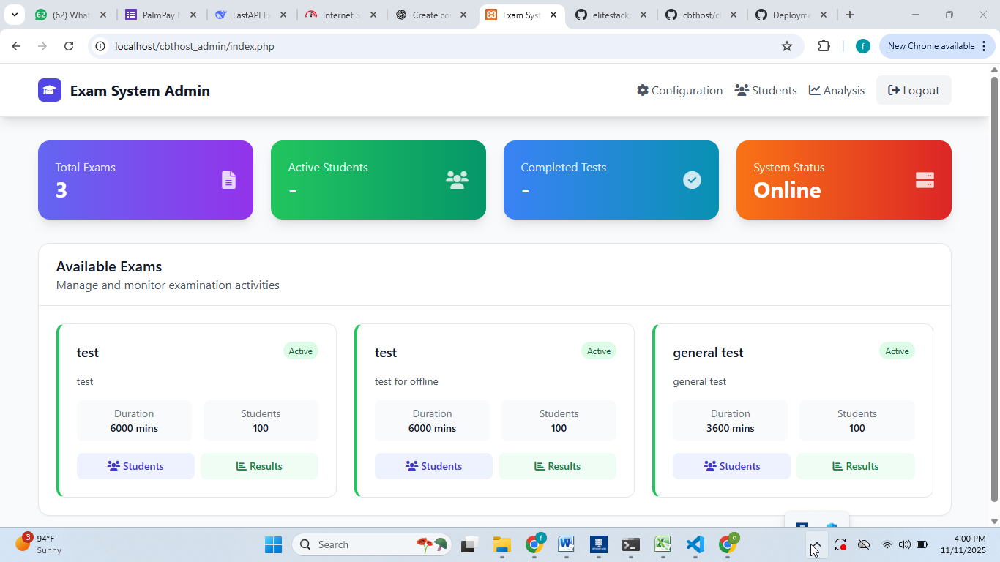
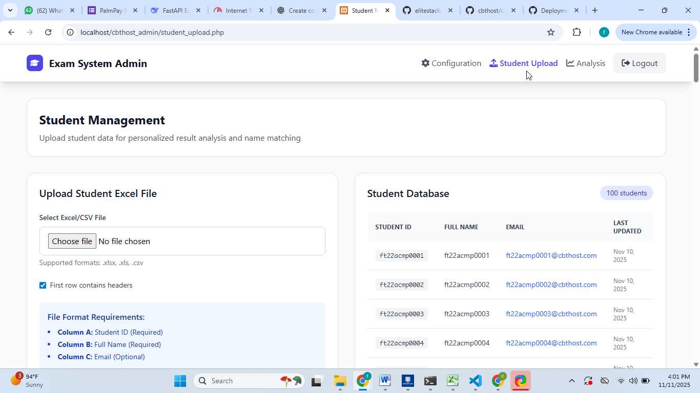
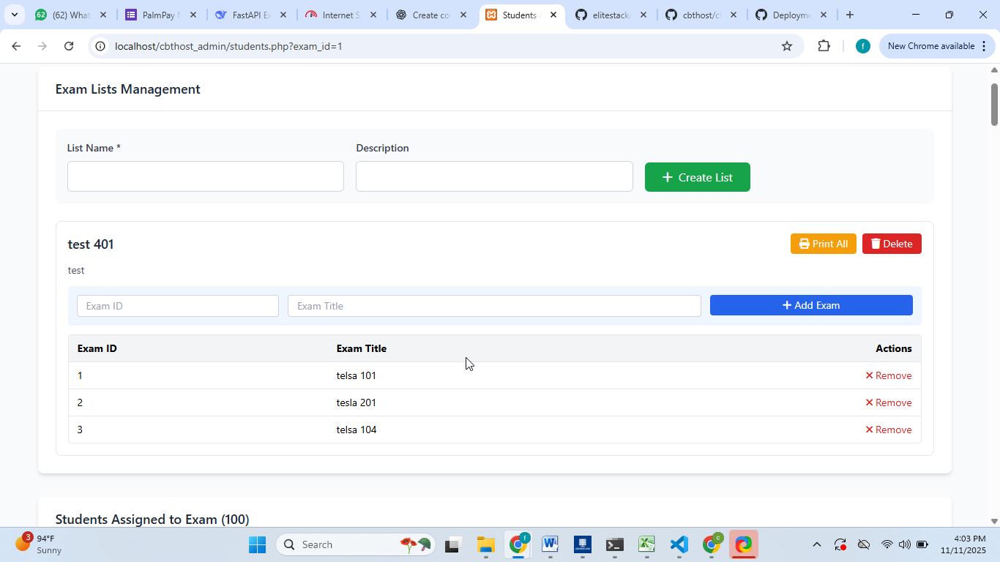
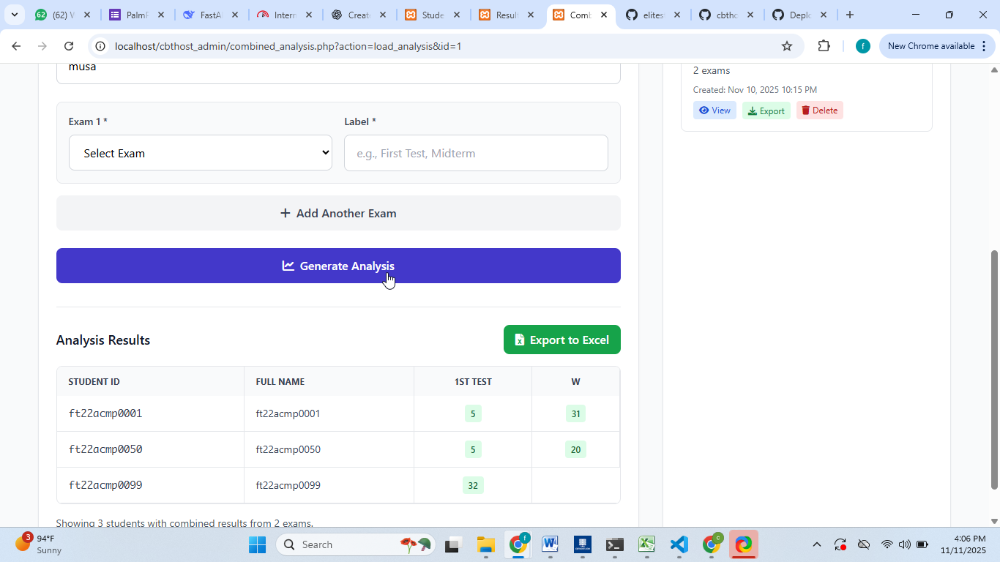

# 🧠 CBTHost Exam System (PHP Admin Panel)

> **CBTHost.com | The Complete CBT Solution for Schools, Colleges & Training Centers**

The **CBTHost Exam System** is an **open-source PHP-based admin panel** for managing **Computer-Based Tests (CBT)** — designed to **connect and synchronize** with the official CBTHost Offline Software.  
It provides tools for managing **students, exams, results, and printable exam cards** — all accessible locally using **XAMPP** or **WAMP**.

🔗 **Official Site:** [https://cbthost.com](https://cbthost.com) :contentReference[oaicite:1]{index=1}  
📦 **Download the Offline Software:** [https://cbthost.com/download](https://cbthost.com/download) :contentReference[oaicite:2]{index=2}  

---

## 🚀 What Is CBTHost?

CBTHost is a powerful hybrid **Computer-Based Testing (CBT)** platform that combines **offline capability** with **online synchronization**. :contentReference[oaicite:3]{index=3}

This open-source Admin Panel allows schools and institutions to:
- Manage **student records**  
- Manage **exams and results**  
- **Print exam cards and results**  
- Combine multiple exam results for analysis  
- Integrate seamlessly with the CBTHost Offline CBT Software  

---

## 🧩 Key Features

### 🧑‍🎓 Student Management
- Upload students from Excel or CSV  
- Manage, edit, and search students locally  
- Auto-match student names with results  

### 🧾 Exam Management
- Create exam lists and categories  
- Generate and print exam cards for any exam or class  
- Export or view student scores with one click  

### 📊 Combined Result Analysis
- Combine results from multiple exams  
- Export data to Excel automatically  
- View student performance across all exams  

### 🖨 Printing Tools
- Print single or bulk exam cards  
- Print result sheets with detailed analytics  
- Professional printable layout  

### 🔗 Offline Integration
- Connects directly with CBTHost Offline CBT Software  
- Syncs student and exam data seamlessly  
- Works locally on **XAMPP** or **WAMP** servers  

---

## 🖼️ Screenshots

### Dashboard  
  

### Login Page  
  

### Student Upload (CSV/Excel)  
  

### Student Data Table  
  

### Student Results View  
  

### Single Student Result Detail  
  

### Result Analysis – View 1  
  

### Result Analysis – View 2  
  

### Mass Exam Card Printing  
  

### Exam Card Print Page  
  

### All Students in One Account View  
  

---

## 🖥️ System Requirements

- PHP **7.4+**  
- MySQL **5.7+**  
- **XAMPP** or **WAMP** for local hosting  
- Web browser (Chrome or Firefox recommended)  

---

## 📁 Excel Templates for Importation

### 🔹 Student Import Template  
| Student ID | Full Name        | Email                |
|------------|-------------------|-----------------------|
| STU0001    | John Doe          | johndoe@example.com   |
| STU0002    | Jane Smith        | janesmith@example.com |

**Notes:**  
- The first row should be headers exactly as shown: *Student ID*, *Full Name*, *Email*.  
- Save file as `.xlsx` or `.csv`.  
- Use the Admin Panel’s **“Import Students”** function to upload.

### 🔹 Question Import Template  
| Question Text                            | Option A | Option B | Option C | Option D | Correct Answer |
|------------------------------------------|----------|----------|----------|----------|----------------|
| What is the capital of France?           | London   | Berlin   | Paris    | Madrid   | C              |
| Which element has atomic number 1?       | Helium   | Hydrogen | Oxygen   | Nitrogen | B              |

**Notes:**  
- Header row must exactly match: *Question Text*, *Option A*, *Option B*, *Option C*, *Option D*, *Correct Answer*.  
- Correct Answer should correspond to one of the option letters (A–D).  
- After upload, map the question sets to an exam in the system.

---

## ⚙️ Installation & Setup (XAMPP/WAMP)

### Step 1: Clone the Project  
```bash
git clone https://github.com/yourusername/cbthost-exam-system.git
