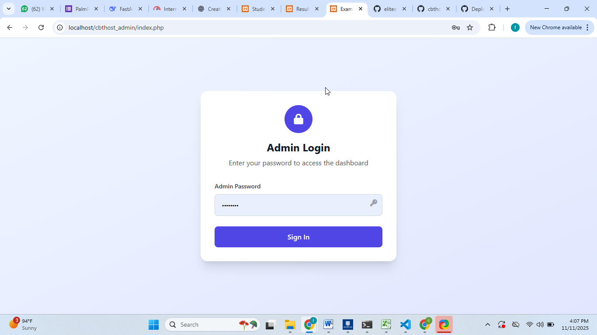
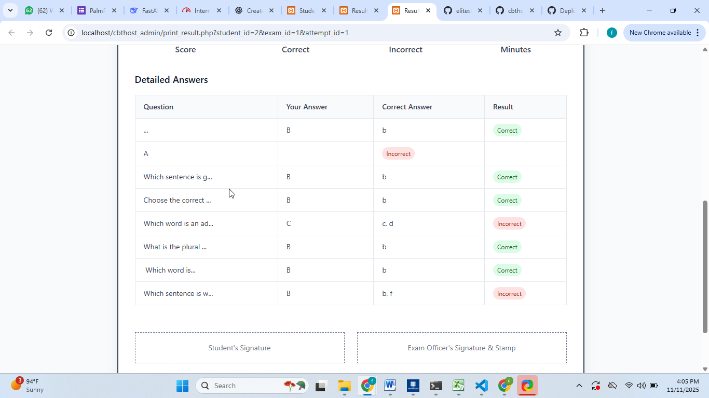
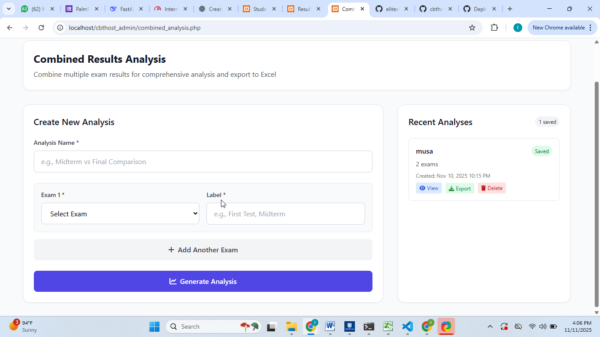

# 🧠 CBTHost Exam System (PHP Admin Panel)

> **CBTHost.com | The Complete CBT Solution for Schools, Colleges & Training Centers**

The **CBTHost Exam System** is an **open-source PHP-based admin panel** designed to manage **Computer-Based Tests (CBT)**. It works seamlessly with the official **CBTHost Offline Software** to provide a hybrid online-offline testing solution.  

It allows you to **manage students, exams, results, and printable exam cards**, all locally via **XAMPP** or **WAMP** servers.  

🔗 **Official Site:** [https://cbthost.com](https://cbthost.com)  
📦 **Download Offline Software:** [https://cbthost.com/download](https://cbthost.com/download)  

---

## 🚀 What is CBTHost?

CBTHost is a powerful hybrid **Computer-Based Testing (CBT)** platform combining **offline functionality** with **online synchronization**.  

This open-source admin panel allows schools and training centers to:  
- Efficiently **manage student records**  
- **Create, organize, and grade exams**  
- **Print exam cards and detailed results**  
- Perform **combined analysis across multiple exams**  
- Integrate seamlessly with the **CBTHost Offline CBT Software**  

---

## 🧩 Key Features

### 🧑‍🎓 Student Management
- Upload student lists via Excel or CSV  
- Edit, search, and manage students locally  
- Auto-match student names with exam results  

### 🧾 Exam Management
- Create exam lists, categories, and schedules  
- Generate and print exam cards for individual or bulk exams  
- Export or view student scores with one click  

### 📊 Combined Result Analysis
- Merge results from multiple exams  
- Export consolidated results to Excel  
- Track student performance across all exams  

### 🖨 Printing Tools
- Print individual or bulk exam cards  
- Print results with full analytics  
- Professional and clear print layout  

### 🔗 Offline Integration
- Connect directly with CBTHost Offline CBT Software  
- Sync student and exam data seamlessly  
- Operates locally on **XAMPP** or **WAMP**  

---

## 🖼 Screenshots

### Dashboard  
  

### Login Page  
  

### Student Upload (CSV/Excel)  
  

### Student Data Table  
  

### Student Results View  
  

### Single Student Result Detail  
  

### Result Analysis – View 1  
  

### Result Analysis – View 2  
  

### Mass Exam Card Printing  
  

### Exam Card Print Page  
  

### All Students in One Account View  
  

---

## 🖥 System Requirements

- PHP **7.4+**  
- MySQL **5.7+**  
- **XAMPP** or **WAMP** for local hosting  
- Modern web browser (Chrome or Firefox recommended)  

---

## 📁 Excel Templates for Import

### 🔹 Student Import Template  
| Student ID | Full Name | Email |
|------------|-----------|-------|
| STU0001    | John Doe  | johndoe@example.com |
| STU0002    | Jane Smith| janesmith@example.com |

**Notes:**  
- Header row must match: *Student ID*, *Full Name*, *Email*.  
- Save as `.xlsx` or `.csv`.  
- Use **“Import Students”** in the Admin Panel to upload.  

### 🔹 Question Import Template  
| Question Text | Option A | Option B | Option C | Option D | Correct Answer |
|---------------|----------|----------|----------|----------|----------------|
| What is the capital of France? | London | Berlin | Paris | Madrid | C |
| Which element has atomic number 1? | Helium | Hydrogen | Oxygen | Nitrogen | B |

**Notes:**  
- Header row must match exactly: *Question Text*, *Option A*, *Option B*, *Option C*, *Option D*, *Correct Answer*.  
- Correct Answer must correspond to **A, B, C, or D**.  
- After import, assign questions to an exam within the system.  

> ✅ **All questions must be uploaded and managed through [CBTHost.com](https://cbthost.com) with a login account.**  

---

## ⚙️ Installation & Setup (XAMPP/WAMP)

### Step 1: Clone the Project  
```bash
git clone https://github.com/cbthost/cbthost-exam-system.git
